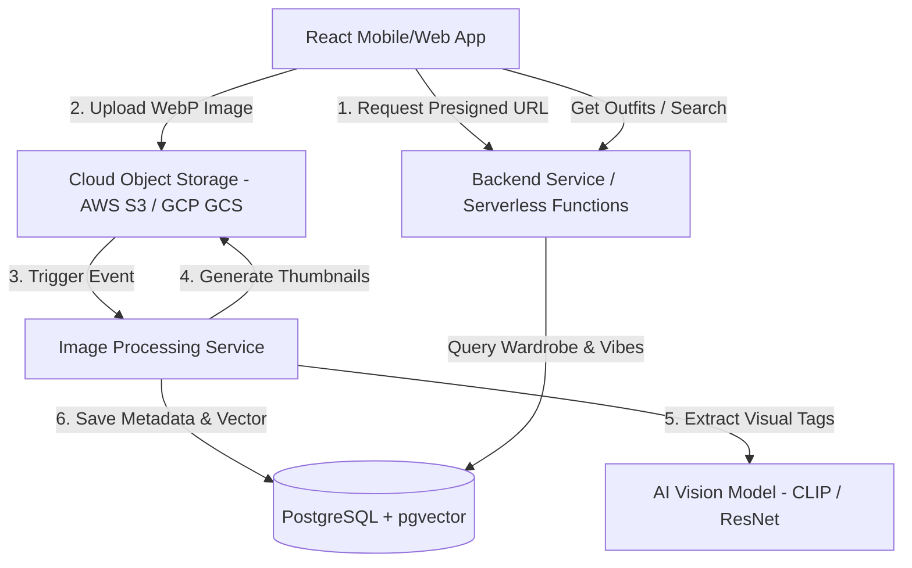

# Pink Petal Closet — System & Database Architecture

This document describes the high-level architecture, database design, and technical workflow for the **Pink Petal Closet** digital wardrobe and AI-powered outfit generator.

---

## 1. System Overview

The system is designed as a modern, high-performance web/mobile application using a decoupled client-server architecture to ensure scalable image handling and smooth user experiences.



---

## 2. Database Schema

The database requires relational storage for closet metadata and vector capabilities for visual similarity search and vibe-based outfit generation. We propose **PostgreSQL** with the **pgvector** extension.

### `users` Table
Stores user profile and account details.
```sql
CREATE TABLE users (
    id UUID PRIMARY KEY DEFAULT gen_random_uuid(),
    email VARCHAR(255) UNIQUE NOT NULL,
    display_name VARCHAR(100),
    created_at TIMESTAMP WITH TIME ZONE DEFAULT CURRENT_TIMESTAMP,
    updated_at TIMESTAMP WITH TIME ZONE DEFAULT CURRENT_TIMESTAMP
);
```

### `wardrobe_items` Table
Stores digitized clothes, categories, image references, and AI tags.
```sql
CREATE TYPE clothing_category AS ENUM (
    'tops', 'bottoms', 'dresses', 'footwear', 'accessories_necklace', 
    'accessories_bracelet', 'accessories_headwear', 'bags', 'jackets'
);

CREATE TABLE wardrobe_items (
    id UUID PRIMARY KEY DEFAULT gen_random_uuid(),
    user_id UUID REFERENCES users(id) ON DELETE CASCADE,
    name VARCHAR(255) NOT NULL,
    category clothing_category NOT NULL,
    image_url TEXT NOT NULL,                -- High-quality original image url
    thumbnail_url TEXT NOT NULL,            -- Low-latency thumbnail url
    color_palette JSONB,                    -- Dominant colors extracted (HEX and ratio)
    auto_tags TEXT[] DEFAULT '{}',          -- Tags generated by AI Vision
    user_tags TEXT[] DEFAULT '{}',          -- Custom tags added/edited by the user
    embedding vector(512),                  -- Multi-modal visual embedding (CLIP ViT-B/32)
    is_favorite BOOLEAN DEFAULT false,
    created_at TIMESTAMP WITH TIME ZONE DEFAULT CURRENT_TIMESTAMP,
    updated_at TIMESTAMP WITH TIME ZONE DEFAULT CURRENT_TIMESTAMP
);

CREATE INDEX idx_wardrobe_user_category ON wardrobe_items(user_id, category);
CREATE INDEX idx_wardrobe_embedding ON wardrobe_items USING hnsw (embedding vector_cosine_ops);
```

### `outfits` Table
Stores curated or AI-generated outfit configurations.
```sql
CREATE TABLE outfits (
    id UUID PRIMARY KEY DEFAULT gen_random_uuid(),
    user_id UUID REFERENCES users(id) ON DELETE CASCADE,
    name VARCHAR(255),
    vibe_query TEXT,                        -- Prompt used to generate this outfit (e.g. 'cozy coffee date')
    is_saved BOOLEAN DEFAULT false,
    items JSONB NOT NULL,                   -- Mapping of category keys to wardrobe_item IDs
                                            -- e.g., {"tops": "uuid", "bottoms": "uuid", ...}
    created_at TIMESTAMP WITH TIME ZONE DEFAULT CURRENT_TIMESTAMP
);
```

---

## 3. High-Quality Image Pipeline

To minimize storage costs and ensure rapid page load times on both mobile and web clients:

1. **Client-Side Optimization**: Before uploading, the image is compressed and converted to **WebP** format. Images are resized to a maximum width of 1200px (high quality) and 300px (thumbnails).
2. **Secure Upload**: The client requests a pre-signed URL from the backend and uploads directly to Object Storage (AWS S3 or GCP Cloud Storage) to reduce server load.
3. **Background Image Processing**:
   - Upload triggers a serverless function (AWS Lambda).
   - The function removes the background of the garment (using an API like Remove.bg or a self-hosted U2Net model) to create a clean, boutique-style showcase item.
   - Saves the background-removed WebP image and generates a thumbnail.
   - Extracts dominant color signatures using k-means clustering on image pixels.

---

## 4. AI Auto-Tagging & Outfit Stylist Logic

### Auto-Tagging
When a wardrobe item is uploaded, a vision-language model (e.g., CLIP, BLIP, or Google Cloud Vision API) analyzes the image.
- **Inputs**: Background-removed garment image.
- **Outputs**:
  - Main category classification (Top, Bottom, etc.) with a confidence score.
  - Sub-attributes: color, material (denim, knit, silk), pattern (striped, floral, solid), and vibe tags (boho, minimal, casual, formal).
- The user can review and edit these tags in the "Add Item" flow.

### Vibe-Based Outfit Generation (The AI Stylist)
The Outfit Assistant uses a combination of natural language query parsing and wardrobe item embeddings:
1. **Query Parsing**: The user's input (e.g., *"I'm going to a summer beach wedding"*) is processed by an LLM or matched against visual embedding space.
2. **Aesthetic/Vibe Mapping**:
   - Extract key attributes from the prompt: **Context/Event** (wedding $\rightarrow$ formal), **Season** (summer $\rightarrow$ light fabric, pastel colors), **Setting** (beach $\rightarrow$ airy, dresses, sandals).
3. **Constraint Solver & Selection**:
   - Match categories needed for a complete outfit (either Top+Bottom or Dress, plus Footwear, Bag, and optional Accessories/Jacket).
   - Query the `wardrobe_items` table using vector similarity between the vibe query and item embeddings, or filter based on tag similarity.
   - Ensure color compatibility using basic color-wheel harmony rules (complementary, analogous, monochrome) on `color_palette`.
4. **Interactive Controls (Locking & Shuffling)**:
   - If a user locks a specific item (e.g., a Sage Green skirt), the algorithm queries remaining categories (e.g., Tops, Footwear) that match both the vibe query AND have visual/color compatibility with the locked item.
   - Removing optional items (e.g., Jackets) simply drops that category constraint from the active query pool.
