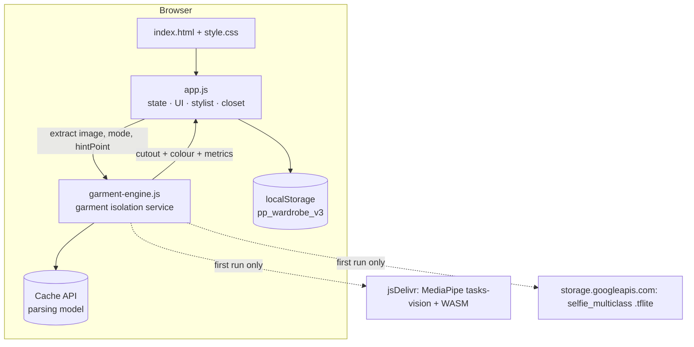
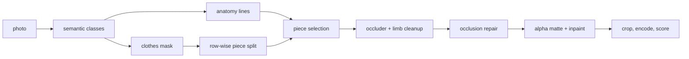
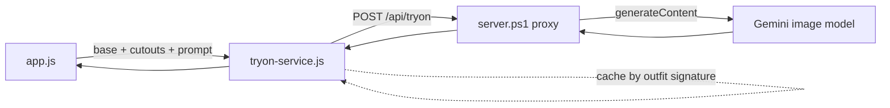
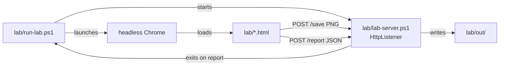

# Architecture (as built)

This describes the application **as it actually runs today**. For the proposed
cloud backend (Postgres + pgvector, object storage, serverless processing) see
[`../architecture.md`](../architecture.md); that document is a design target, not
a description of this code.

---

## 1. Shape of the thing

A static, client-side web app. No build step, no bundler, no package manager, no
server-side logic.

```
index.html          markup for both panes (desktop dashboard + phone simulator)
style.css           all styling, design tokens in :root
garment-engine.js   the garment isolation service  (standalone, ~1650 lines)
vlm-service.js      the vision service    (what is in this photo, and where)
tryon-service.js    the AI try-on service (standalone, talks to the proxy)
app.js              the application: state, UI, stylist, closet  (~1500 lines)
server.ps1          static file server + the /api/tryon proxy
assets/             garment and mannequin images shipped with the app
docs/               this folder
lab/                validation harness for the engine (never loaded at runtime)
```

Everything runs in the browser. The only network calls are Google Fonts and the
one-time model fetch described in §9.



---

## 2. The one boundary that matters

`garment-engine.js` is a **service**, not a helper module. It owns every pixel
decision; `app.js` owns everything else. The two meet at a single function:

```js
GarmentEngine.extract(imageSrc, options) -> Promise<Result>
```

The engine knows nothing about wardrobes, categories-as-app-concepts, closets or
localStorage. The app knows nothing about masks, clusters or alpha mattes. That
boundary is what makes the engine testable in isolation (§11) and replaceable.

`app.js` section 8 is the whole adapter — it translates the app's vocabulary
(`extractionMode`, form fields, tag strings) into engine options and back. If you
ever swap the engine for a server-side cutout API, section 8 is the only part of
`app.js` that changes.

**Load order matters:** `garment-engine.js` must be included before `app.js`
(see the bottom of `index.html`), because the adapter reads `window.GarmentEngine`.

---

## 3. app.js section map

`app.js` is one file divided by numbered banner comments. In dependency order:

| § | Responsibility |
|---|---|
| 1 | Engine metadata (`AI_ENGINE_INFO`) — descriptive only |
| 2 | Shipped wardrobe: `DEFAULT_ITEMS`, `PRESET_UPLOADS` |
| 3 | Module state: `wardrobe`, `activeOutfit`, `extractionMode`, `studioState` |
| 4 | `initApp()` — restore closet, warm the engine, wire events, first render |
| 5 | Clipboard paste listener and all DOM event wiring |
| 6 | Tab navigation (desktop + phone panes) |
| 7 | Closet grid: render, filter, favourite, delete |
| **8** | **Isolation adapter over `garment-engine.js`** |
| 9 | Upload pipeline: file/paste → engine → preview → form → save |
| 10 | Cutout Editor: tap-to-select, drag box, live preview, and the Erase / Draw Back / Fill In retouch brush over `modules/cutout-paint.js` ([modules.md §2b](modules.md)) |
| 11 | Stylist engine: vibe parsing, scoring, locking, shuffling, and the per-slot "not today" opt-out (`OPTIONAL_SLOTS`, `pp_slot_optout`) |
| 12 | The outfit picture: draws the flat display, or a blank board (§5) |
| 12b | See It Worn: sends the mannequin and cutouts to an image model (§7), and keeps the result against the look (§10) |
| 12c | The display board: a thin adapter over `modules/outfit-display.js` ([modules.md](modules.md)) |
| 13 | "Style around this item" base-item picker |
| 13b | Saved looks: store, the My Looks page, and putting a look back on the board |
| 14 | Phone pane — wired to the same functions the dashboard calls, not a mock |
| 15 | Helpers: stats, persistence, `sleep` |

State lives in module-scoped `let` bindings, deliberately not on `window`. Note
the consequence: external code (including test harnesses) cannot read or write
`wardrobe` / `studioState` directly — it must go through the exported functions
and `localStorage`. `lab/app-smoke.html` is written that way on purpose.

---

## 4. Isolation pipeline

Ten stages inside `extract()`. The stage numbers in this table match the banner
comments in `garment-engine.js`.

| Stage | What happens | Why it is done this way |
|---|---|---|
| 1 | Decode, downscale to ≤768px (`procMaxDim`), optional `cropBox` | Mask maths at a fixed budget keeps runtime flat regardless of input size |
| 2a | **Semantic pass** — MediaPipe selfie-multiclass gives per-pixel probabilities for background / hair / body-skin / face-skin / clothes / accessory | A model that knows what clothing *is* replaces every colour heuristic that came before |
| 2b | **Fallback** — adaptive border flood fill + multi-colour-space skin detector, used when the model cannot load | Offline first-run still produces something, clearly labelled |
| 3 | **Anatomy** — shoulder / hip / knee lines from the *face* mask | Hair reaches the waist; deriving the head from hair threw every landmark off and made "top" select the jeans |
| 4 | **Piece split** — each row assigned to a garment by dominant Lab cluster; runs of rows merged into stacked pieces | Selecting by colour blob *shatters* a dress along its own folds. Rows keep pieces solid. A gap with no clothing (bare midriff) hard-separates same-coloured garments; a thin contrasting band (belt) does not split one |
| 5 | **Selection** — pieces scored on relative position in the stack; a dress claims joined pieces of the same colour family | Absolute landmarks are unreliable on cropped and seated poses; stack order is not |
| 6 | **Cleanup** — accessory colour-islands, thin diagonal straps, bare limbs read as fabric | Each is a distinct failure mode with a distinct shape signature (§8) |
| 6b | **Occlusion repair** — fabric hidden behind hair or a limb is put back, in two passes: `repairOccluded` from pixels the parser called clothing and cleanup deleted, `repairOccluderBites` from pixels it called hair or skin in the first place | The second is the common case and nothing used to catch it. Hair over a shoulder is never labelled clothing, so it never enters `removed`; and a bite is an indentation open to the outside, not an enclosed hole, so `fillHoles` leaves it alone. Result: a cutout with a wedge missing (a model's forearm took 4% out of a red dress) |
| 7 | **Matting** — trimap + local linear alpha + colour decontamination, then every reconstructed area inpainted from the surrounding fabric | Soft edges without background bleed; a strap removal or an occlusion bite leaves fabric, not a hole. The blur that softens the paint is weight-normalised so it cannot reach across the silhouette — unconfined, it pulled the skin just outside a bite into the repair and filled a black dress with mauve |
| 8 | **Render** — tight crop, pad, upscale, encode (§10) | |
| 9 | **Metrics** — score the result against the semantic masks | Lets callers detect a bad cutout instead of shipping it |



### Which path a photo takes, and the bug that hid in it

`extractGarment` has three isolation paths, and only one of them repairs
occlusion:

| Path | For | Repairs hair/limb bites |
|---|---|---|
| `GarmentEngine.extract` | someone wearing the garment | **yes** |
| `cutoutViaModules` (backdrop flood) | flat backdrop, no wearer — the only thing that gets white-on-white right | no |
| `GarmentEngine.extractObject` | a box round an object in a cluttered scene | no |

The route used to be chosen by *"did the user drag a box"*. That conflates two
unrelated facts: **a box says where the garment is, not what else is in the
frame.** A box drawn round a garment someone was wearing therefore sent the
photo to the backdrop-flood path, which has no notion of hair or skin — so hair
and hands stayed cut out of the garment, and the repair was never in the code
that ran. No amount of work on the repair could have fixed that.

A second fault sat underneath it: the box was handed to the cutout module in
source pixels under the field names `width`/`height`, where it expects fractions
of the frame under `w`/`h`. So the region had an undefined width and an `x` in
the hundreds, the module searched outside the picture, and every boxed
extraction failed with *"nothing found inside the region"* — a dragged box
behaved worse than no box at all. `regionFromCropBox` now converts it.

The route is now decided by asking the picture. `GarmentEngine.detectPerson`
runs only the semantic pass — one model call, no pipeline — and leans on the
**face**: bare arms in a flat-lay and a beige backdrop both read as skin to a
colour rule, but a face does not appear unless somebody is there. Measured on
the fixtures, a worn dress scores `faceFrac` 0.042 and a flat product shot 0.
The answer is memoised per photograph, because the Cutout Editor re-runs the
isolation on every preset pill and every tap of the same picture.

`lab/path-probe.html` drives all four routes through the real app and checks
which backend each reaches — the three worn routes must land on `mediapipe` and
come back with `occluded > 1%`, and the white blouse must still land on
`watershed`.

---
## 5. The outfit picture

Before a render there is **no mannequin**. The picture is a flat-lay: the
outfit's own cutouts laid out on white, scaled and arranged so each piece can be
seen. `See It Worn` (§7) is what puts them on a mannequin, by sending them and
the bare `mannequin_base.jpg` to an image model.

> **The layout lives in `modules/outfit-display.js`.** Section 12c is a thin
> adapter: it finds the cutouts, calls `OutfitDisplay.render(items)`, and puts
> the result on screen.

### Why the mannequin went away

Two versions of this view stood on the mannequin, and both failed the same way.
The first reshaped each garment to the body row by row; the second stopped
reshaping and simply placed the flat photographs on it. The second made the
problem plain rather than fixing it: **the body is in the picture**, so every
place the fabric does not follow it reads as a defect — a hem floating off a
hip, a sleeve stopping in mid-air, a waistband crossing the wrong part of the
torso. None of that is a defect in the garment. It is what a photograph taken
flat looks like against a shape it was never draped over.

A flat-lay claims nothing about drape, so nothing about it can look wrong. And
it answers the question this view is actually for — *which pieces did the
stylist pick* — better than the mannequin did, because every piece is shown
whole, at a size chosen for legibility rather than anatomy.

### What the layout has to get right

| Requirement | Why it is not optional |
|---|---|
| relative size | a dress must read bigger than a bracelet, or the board stops looking like an outfit and starts looking like a spreadsheet. Sizes come from `DISPLAY_HEIGHT`, a share of the board per category — sizing by the cutout's own pixels would make whichever garment was photographed closest the biggest thing on it |
| a floor under that | a bracelet cutout is a thin sliver of a photograph and vanishes under any honest rule. `minHeight`/`minWidth` enlarge it until it meets whichever floor it reaches **first** — insisting on both would blow a wide item up until it filled the board |
| any combination | one dress, or a top and a jacket and three accessories. Shelf packing has no special cases: each piece gets a size and the rows fall out of the arithmetic. A fixed table of positions would need an answer for "where does the jacket go when there is also a dress and two bracelets" |
| white garments on white | a linen blouse on a white board has no edge at all. Every piece gets a soft, offset blur of its own alpha, so it has a boundary without being tinted |
| a board the size of the look | the panel takes its height from this image (`.mannequin-img{height:auto}`), so a fixed portrait board left a third of the space empty and drew the clothes smaller than they needed to be. The board is cut down to its content, between `minBoardHeight` and `height` |

`growLimit` caps how far the whole board may be enlarged to fill the width. It
is what keeps the size floor a floor rather than a target: without it a lone
bracelet is inflated into a hula hoop.

The stock lookbook photographs are **gone**, along with `MANNEQUIN_LOOKBOOK`,
`pickLookbookPhoto()` and the mode switch. Nine fixed looks cannot show an
arbitrary combination: there was no shot of a pink knit top with blue jeans, so
one of the two was always wrong, and pinning a garment that appeared in only one
photograph froze the picture — shuffling the other slots changed the list while
the mannequin sat still. An empty board now draws a blank white board and says
so, rather than a stranger's outfit.

### What became unused

`modules/outfit-compose.js` layered fitted garments onto the mannequin, and
nothing calls it any more. It is kept, with its harness, because it is the
finished half of a problem the AI render may not always be available to solve —
but it is honest to record that the app does not run it. `garment-fit.js` and
`body-model.js` are still live: `aiFitWholeCloset` measures a garment's fit to
decide whether a paid render would help it.

The conclusion that survived from every attempt to make flat photography look
worn: it cannot be done by 2D compositing. That is what the image model in §7 is
for, and why the button that calls it is the one control under the picture.

---
## 6. Vision model (VLM)

A vision-language model looks at photos and answers in JSON. This is a **different
API quota from image generation**, so it works on a free-tier key where a
generated try-on render does not. `vlm-service.js` asks two questions:

| Call | Question | Used for |
|---|---|---|
| `analyzeGarment(photo)` | which item is this photo about, where is it, what is it made of? | extraction: category, name, colour, and a box to cut inside |
| `analyzeCutout(cutout)` | where does this garment meet the body? | the mannequin: which row is the shoulder seam or waistband |

**The split of labour matters.** The model is good at *what* and *where* and
bad at precise measurement: asked for the garment's width at the shoulder it
returned values that scaled tops 2-3x too large. So the model supplies the
anchor row and the pixels supply the width at that row, measured from the
cutout's own alpha.

### Box-guided isolation

`GarmentEngine.extractObject(src, {region})` cuts an object out of a product
shot, which the person-parsing model cannot help with. It builds a colour model
from outside the box, seeds the subject from the parts *inside* the box that do
not look like that background, and grows with an edge barrier where colour
cannot separate them. That last part is what lifts a white top off a white
sweep — the case that used to return a thin sliver.

### Free-tier quota

The cap is `GenerateRequestsPerDayPerProjectPerModel` — **per day, per model**.
The proxy therefore holds a list of models and walks it when one is exhausted,
remembering the one that last worked so an exhausted model is not retried on
every call. Measurements are cached in `localStorage` (`pp_worn_v1`) so each
garment is measured once, ever.

## 7. AI try-on

The render in §5 shows a stock photograph, not the actual look. To put the real
garments on the mannequin convincingly there is a second path — hand the bare
mannequin and the outfit's cutouts to an image model and let it dress the body.



**The key never reaches the browser.** `server.ps1` reads `GEMINI_API_KEY` from
the environment and forwards the request; the page only talks to `/api/tryon`.

| Piece | Responsibility |
|---|---|
| `tryon-service.js` | builds the prompt, downscales the images (mannequin 832px, garments 512px), calls the proxy, caches by outfit signature, de-duplicates in-flight requests |
| `server.ps1` `/api/tryon` | forwards to the model, unwraps the image, passes API errors back verbatim |
| `server.ps1` `/api/tryon/status` | tells the page whether a model is configured, so the UI can hide the control |
| `app.js` `renderOutfitWithAI()` | swaps the render in, leaves the ordinary picture alone on failure, drives the button, and remembers the render against the look |

Design decisions worth knowing:

- **Renders are paid, so they are never implicit.** The flat display shows
  first; the model is called only when the user presses *See It Worn*. There was
  an *auto* checkbox beside it that rendered every new look as it appeared —
  which turned generating and shuffling, the two things the app most invites you
  to do, into spending. A setting whose best configuration is "off" is not a
  setting, and it is gone.
- **Every render outlives the tab, and none is evicted.** `tryon-service` caches
  by outfit signature in a `Map`, which dies on reload, so the same five
  garments were paid for again the next day — the look had not changed; a
  variable had. `app.js` keeps renders in **IndexedDB** under
  `OUTFIT_PROMPT_VERSION + signature`, re-encoded to 720px WebP (~30-90 KB).
  IndexedDB rather than `localStorage` because `localStorage` has about five
  megabytes for the whole app and therefore forced a cap: a render you had paid
  for could vanish because you had rendered others since, which is the wrong
  behaviour for something bought. `localStorage` remains the fallback for a
  private window or a browser blocking site data, and only there does a cap
  apply, because only there is space actually scarce. The keys alone are held in
  memory (`renderKeys`), which is what lets synchronous UI code ask *has this
  look been rendered?* without awaiting; images are fetched only when shown.
- **A stored render is never shown unasked.** An earlier version jumped straight
  to one whenever it existed, on the grounds that it was paid for and was the
  better picture. That was wrong: a look rendered once could then never be seen
  as its own pieces again, and *See It Worn* stopped being a choice — the app
  had made it. The two views answer different questions (**which** pieces,
  versus how they hang), so the flat display always comes first and the caption
  says when pressing will cost nothing.
- **Failure is never destructive.** A refused or failed render leaves the picture
  that was already there and puts the reason in the status line.
- **The proxy retries once without `responseModalities`**, since some model
  revisions reject that field, and it accepts both `inlineData` and
  `inline_data` in the response.
- `PP_TRYON_MOCK=1` makes the proxy echo the mannequin back, which exercises the
  whole client path — status probe, image collection, swap, cache — with no key
  and no cost. That is how the path is tested here.


### Keeping the garment the garment

An image model asked to make a shop-window photograph of a dress will, given
half a chance, make a *better* dress. Reported: a floral dress came back a
different colour and a different length. Two things were done about it, and only
the second is a guarantee.

**The prompt was rewritten** — both of them, the whole-outfit one in
`tryon-service.js` and the per-garment ghost-mannequin one in
`modules/worn-render.js`. Version 1 said "keep each garment's exact colour,
pattern, texture and details": one clause, buried mid-list, and **length was
never mentioned at all**. What replaced it:

- fidelity is the **first** thing the prompt says and the **last**, not a line in
  the middle
- the garment images are declared to *be* the garments — "not a reference, not
  inspiration" — which is the distinction the failure turns on
- the rules are **prohibitions**. "Do not shorten the hem" binds an image model
  in a way "keep the length" does not, because a negative names the specific act
  it might otherwise perform
- colour, print, **length** and cut each get their own named rule, with the
  concrete failures spelled out: do not saturate it, do not substitute another
  floral, a midi stays midi
- the colour is **stated**, because an explicit target beats a rule to remember —
  but measured, not looked up. See below; getting this wrong made things worse
- the images are declared the **authority** over any word in the prompt, and the
  item's own name is explicitly disowned as a colour source
- an explicit **no scene tint** rule: the mannequin photograph is a warmly-lit
  boutique, and a model harmonising a garment with that light is one of the ways
  a colour drifts without anything "changing" it
- `WornRender.PROMPT_VERSION` went to 3, so renders stored under older wording
  are treated as stale

#### The colour must be measured, not looked up

The first attempt at "state the colour" used the wardrobe's stored `colorName`,
and **made the problem worse**. A yellow dress came back amber — and the item
was called *"Amber Dress"*, because `GarmentEngine.describeColor` is a
twenty-bucket table in which any saturated hue from 25 to 45 is "Amber". The
prompt was therefore asserting *"its colour is amber"* about a yellow dress: it
was asking for the drift it had been written to prevent.

So the colour is now measured from the very pixels being sent
(`TryOnService.colourOf`), stated as an sRGB triplet beside a phrase derived
from those same numbers, and the prompt says the image wins over any wording.
`colourPhrase` is deliberately finer than the wardrobe's naming where it
matters: measured on sRGB(230, 180, 55), the wardrobe says **"Amber"** and the
phrase says **"light vivid golden yellow"**. A measurement cannot contradict the
image it came from; a label can, and did.

The lesson is not "don't name the colour" — naming it is the strongest single
anchor available. It is that the only name worth stating is one derived from the
pixels in the request.

**A prompt is a request, not a guarantee**, so the per-garment path now measures
the render before keeping it. This matters more than it sounds: that cutout
*replaces the wearer's own photograph in every outfit from then on*, so an
unchecked render is not one bad picture, it is the wrong dress for ever.
`WornRender.fidelity(before, after)` compares the render against the
photograph the wearer owns:

| Measure | How | Threshold |
|---|---|---|
| colour | mean CIE Lab over **solidly opaque** pixels only, CIE76 difference. Edge pixels are part background however well matted, and on a white ghost-render background they drag everything towards white | ΔE > 12 |
| length | height over **shoulder** width, not over the widest point — filling a garment out is exactly what a ghost render is *for*, so a plain aspect ratio conflates "correctly filled out" with "wrongly shortened". The shoulders are already at full width in a flat photograph and stay there | drift > 20% |

Calibrated on a real pair — `assets/red_cocktail_dress.jpg` and the faithful
ghost render made from it — which comes in at **ΔE 1.4 and 0.1% drift**, well
inside both thresholds. Proven in the other direction too: a 90° hue rotation is
caught at ΔE 39.9, a hem cut to 62% at −39% drift, a 6° hue shift is accepted as
ordinary tone, and widening a garment's body without touching its hem reads as
0.1% drift rather than a length change. `lab/fidelity-probe.html`.

It errs towards accepting on purpose. A render wrongly refused costs the price of
one call; a render wrongly kept costs the garment.

The whole-outfit render is **not** checked this way, and cannot usefully be: it
returns several garments on a mannequin in a shop, so there is no single colour
or proportion to compare against. What it has instead is a retry — pressing
*See It Worn* while looking at the render it produced forces a fresh call
rather than returning the cached one, because a cached wrong answer was
previously a dead end for the rest of the session.
**What is and is not validated.** The plumbing, the fallbacks and the caching
are covered by `lab/run-tryon-probe.ps1` in mock mode, and the ghost-mannequin
path has been run for real against Vertex AI — `lab/generated/ghost_dress.png`
is one of those renders, and it is what the fidelity measure is calibrated on.
What cannot be regression-tested is the model's behaviour: every check of it
costs a call, and the same prompt does not always produce the same picture. So
the prompts are tested for **what they say** rather than for what comes back
(`lab/fidelity-probe.html`), and the app measures each render it is given rather
than assuming the prompt was obeyed. Prompt tuning has already happened once,
after a floral dress came back recoloured and shortened; expect more.

## 8. Discriminators used in cleanup

These are the rules that separate "part of the garment" from "lying on top of
it". They are stated here because they are the parts most likely to need tuning.

| Removed | Signature | Protected by |
|---|---|---|
| Bag, belt bag | Colour island mostly *surrounded* by garment, hard edge, <18% of piece | A colour-blocked panel or hem band spans the garment's width → kept |
| Strap, necklace chain | Long, thin (mean width ≤2.5% of image), diagonal, high contrast | ≥4 parallel lines are read as texture (pleats, ribbing) → kept |
| Bare limbs parsed as trousers | Garment narrows below 45% of its median width **and** turns the colour of the wearer's own skin | A narrow fabric hem fails the colour test → kept |
| Skin, hair inside the silhouette | Model probability >0.7 | — |

Anything removed from *inside* the silhouette is repaired: the outline is put
back where the removed pixels were boxed in by garment on ≥3 sides, and the gap
is inpainted from surrounding fabric.

---

## 9. External dependencies and offline behaviour

| Resource | Size | Host | When |
|---|---|---|---|
| `tasks-vision` bundle + WASM | ~9.6 MB | cdn.jsdelivr.net | first extraction |
| `selfie_multiclass_256x256.tflite` | 16.4 MB | storage.googleapis.com | first extraction |
| Outfit + Playfair Display fonts | small | fonts.googleapis.com | page load |

The model is stored in the **Cache API** under `pp-garment-engine-v1`, so after
one successful load the engine works offline. `initApp()` warms it at startup so
the first upload does not pay the cost.

If the model is unavailable, `extract()` falls back to colour segmentation,
`result.backend` is `"heuristic"`, and the app says so in a toast rather than
passing the result off as the model's work. Measured fallback quality: 89–96 on
plain-background product shots, 85–87 on people photographed in real scenes.

**The app must be served over HTTP**, not opened as `file://`: the engine reads
pixels back out of a canvas, which a `file://` page is not allowed to do for
local images, and the Cache API needs a secure context.

---

## 10. Data model and storage

### Wardrobe item

```js
{
  id: "u_1725632…",           // "u_" + timestamp for uploads; short ids for shipped items
  name: "Wine Dress",
  category: "dresses",         // tops | bottoms | dresses | jackets | footwear | bags |
                               // accessories_necklace | accessories_bracelet | accessories_headwear
  tags: ["chic", "wine", "dress", "minimal", "boutique"],
  color: "#a30214",            // sampled from opaque cutout pixels only
  colorName: "Wine",
  favorite: false,
  image: "data:image/webp;base64,…"   // the cutout, with alpha
  // shipped items instead carry image:"assets/…jpg", or emoji + gradient
}
```

### Keys

| Key | Contents |
|---|---|
| `pp_wardrobe_v3` | the whole wardrobe array, JSON |
| `pp_look_renders_v1` | **fallback only.** Renders normally live in IndexedDB (`pp_renders` / `looks`), keyed by `OUTFIT_PROMPT_VERSION + outfit signature`, with no cap — nothing paid for is thrown away. This localStorage key is used only where IndexedDB is unavailable, and there a 12-render cap applies by last use |
| `pp_outfits_count_v3` | derived from `pp_looks_v1` on load, not counted independently. It used to be a free-standing number that only went up, because nothing was stored for it to count — so deleting a look could not reduce it |
| `pp_slot_optout` | array of slot categories the wearer has taken out of outfits ("not today"). Filtered against `OPTIONAL_SLOTS` on read, so a stale key from an older build cannot switch off something an outfit needs |

Each wardrobe item also carries `isolated: boolean`. It records whether the
stored picture has already had its background removed, which cannot be told by
looking: an isolation failure parks the raw photograph in the same field, and
both end up as data URLs. `getItemCutout` must isolate one and never the other.
Items saved before this field existed have no value, and are treated as cutouts
so their behaviour does not change.

An item may also carry `occluded: number` — the share of it that was hidden
behind hair or a limb in the original photograph and had to be painted back.
This has to be *stored*, because it cannot be recovered: the repair is seamless
by design, so re-extracting the saved cutout finds no trace of it. It is what
lets `WornRender.worthIt` recommend a paid render for the garments that would
actually gain from one — a mostly-painted garment has the right shape and the
wrong weave, which is exactly what an image model can supply and local code
cannot.

`saveWardrobeData` returns a boolean and reports a full closet through a toast.
Cutouts are large and the budget is small, so a quota failure is a real outcome:
it used to throw from inside the save, after the garment had been pushed onto
the array and before the form was reset, leaving a phantom item and a Save
button that added another copy on every click. The array is now built, persisted,
and only then swapped in.

### Encoding decisions

Cutouts need an alpha channel *and* they live in `localStorage`, which is a
~5 MB budget shared by the whole origin. So the engine encodes **WebP with
alpha** (PNG only where WebP is unavailable), capped at 720px on the long edge:

- measured: **38–52 KB per garment**, so roughly 90–100 uploaded garments fit
- `imagePng` and `imageOnWhite` are returned as well for callers that need
  lossless or a white-matted JPEG; the app does not store those

The active outfit (`activeOutfit`) holds item **ids** per slot, never image data.

---

## 11. Validation architecture

`lab/` exists because the metrics lie on their own: an early build reported
"quality 98" while the dress was coming out in fragments. The harness renders
every intermediate stage so a regression is *visible*.



| Page | Purpose |
|---|---|
| `garment-lab.html` | 18-case suite; 5-panel review sheet per case + metrics |
| `focus.html` | one case, every stage dumped at processing resolution |
| `app-smoke.html` | the wired app driven like a user: upload → tap → apply → save |
| `mannequin-shot.html` | generate → style around an item → shuffle, capturing what the mannequin shows |
| `engine-on-assets.html` | the engine over the shipped catalogue photos |
| `studio-shot.html` | drives the studio for a UI screenshot |
| `tryon-probe.html` | the AI try-on path: status probe, render, cache hit (run via `run-tryon-probe.ps1`) |
| `body-profile.html`, `grid.html` | measuring the mannequin (used by the reverted compositor; kept for reference) |

Clustering is seeded rather than random, so the suite is reproducible: a metric
that moves between runs means the code changed, not the dice.

There is no node/npm/python on the development machine, which is why the harness
is PowerShell + headless Chrome rather than jest/puppeteer.

**Coverage is uneven, deliberately stated:** `dress`, `top`, `bottom` and `auto`
are covered on 7 photo fixtures plus the forced fallback. `footwear`, `bag` and
`jacket` are covered only on flat-lay catalogue photos (`engine-on-assets.html`),
which is the case the mannequin needs but not the case a user uploads.
`accessory` has no fixture at all — treat it as unverified.

---

## 12. Extension points

**A new isolation backend** (server API, different model): implement something
that returns the same per-class probability planes as `semanticMediaPipe()` and
branch in stage 2. Stages 3–9 are backend-agnostic.

**A new garment mode**: add an alias in `MODE_ALIASES`, a scoring case in
`selectPiece()`, and an entry in `CATEGORY_FOR`. If it needs a different base
class than `clothes` (as bags and accessories do), extend the `wantAccessory`
branch where `base` is built.

**A new app category**: add it to `CATEGORY_FOR` in the engine, `CATEGORY_TAG`
and `getEmojiForCategory()` in `app.js`, `activeOutfit.slots`, and the closet
filter buttons in `index.html`.

**Replacing storage** (IndexedDB, a real backend): `saveWardrobeData()` and the
two reads in `initApp()` are the only persistence touchpoints. Cutouts are data
URLs, so they move as-is.

---

## 13. Known limitations

- Where an arm or hand crosses a garment, the edge takes a small bite. The
  parsing model is conservative around occlusions and the repair rule only fills
  gaps enclosed on three sides.
- `auto` mode picks the largest garment nudged upward, so on a full-body photo of
  a top and trousers it may return the trousers. The mode pills and tap-to-select
  are the precise controls.
- `full` mode files its cutout under `dresses`, because a whole-outfit cutout
  occupies the same one-piece slot in the stylist.
- Mannequins are handled by the same model, which reads pale plastic legs as
  trousers; the limb-trim rule catches the common case but is colour-dependent.
- The mannequin draws the real pieces, but they are still flat photographs: a top
  shot with its sleeves spread stays spread, and the silhouette reads as layered
  photography rather than worn fabric. A generated render (§7) is the only way
  past that, and it needs billing enabled.
- The vision model is capped per day per model on the free tier. The proxy walks
  a list of models as each is exhausted, and measurements are cached forever, but
  a heavy day of uploads can still run out — the app then falls back to
  pixel-only isolation and says so in the console.
- Pattern-heavy garments with a large dark motif can trip the accessory rule if
  the motif is fully surrounded by fabric and sharply edged.
- The stylist's vibe matching is keyword-and-colour scoring, not an embedding
  model; `../architecture.md` describes the intended vector-based replacement.
